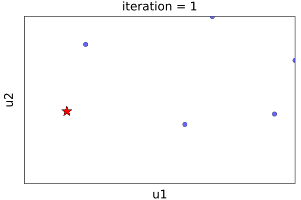

# Calibration features

`KinematicDriver.jl`(KiD) provides tools for calibrating microphysical parameters, using one-dimensional simulations and comparing results with reference particle-based simulations. This process aids in fine-tuning the simulation models to better match detailed simulations of particle-based methods, enhancing the accuracy and reliability of simulation outcomes.
The main particle-based method that is employed as reference for the calibrations is [PySDM](https://github.com/atmos-cloud-sim-uj/PySDM). This Python package is designed for simulating the dynamics of population of particles and features a high-performance implementation of Super-Droplet Method (SDM) Monte-Carlo algorithm for representing collisional growth. 

To perform the calibrations against PySDM results, it is crucial to define the calibration setup and its configuration file accordingly, and to change the CliMA constants where needed. 

## Calibration Methods

KiD supports several calibration methods, including **Ensemble Kalman Inversion (EKI)** [EKI](@cite), **Unscented Kalman Inversion (UKI)** [UKI](@cite), and `Optim.jl` tools.

Both **EKI** and **UKI** are methods that are implemented in the [`EnsembleKalmanProcesses.jl`](https://clima.github.io/EnsembleKalmanProcesses.jl/dev/) library. They are derivative-free Bayesian optimization techniques which are based on ensemble Kalman Filters. Using these methods, we can fit the parameters found in computationally expensive black-box codes, without having to compute derivatives and adjoints. This allows efficient calibration while quantifying parameter uncertainty and model errors.
Specifically:

- **Ensemble Kalman Inversion** uses an ensemble of model states to update the estimates of both the state and the parameters, and it is particularly robust against model errors.
- **Unscented Kalman Inversion** is valuable to explore parameter uncertainties and their correlations.

Additionally, for those who prefer straightforward optimization approaches, we integrate optimization tools from [`Optim.jl`](https://julianlsolvers.github.io/Optim.jl/stable/). 

## Configuration File

To use the calibration tools, it is crucial to provide a configuration file detailing all the elements needed for the calibration process. 
The user must define:

- **Priors**: the prior distributions of the parameters that need to be calibrated. The user must construct a dictionary in which each prior is specified by a `ParameterDistribution` object (see [parameter_distributions](https://clima.github.io/EnsembleKalmanProcesses.jl/dev/parameter_distributions/)). For each parameter, the definition of the prior requires the name of the parameter, the approximate mean and standard deviation of its distribution, and the interval in which it can take values.
- **Observations**: The reference data against which simulations are compared. To do this, you can select the source of data ("perfect_model" or "file"), as well as the data names, data type, and the characteristics of the validation set for the calibrations.
- **Calibration Process**: The methods and approaches used for calibration. In this part, the user must select the calibration method, as well as the variables that are needed for the process (e.g., number of iterations, batch size, random seed, etc.).
- **Model Parameters setup**: Details about the parameters that affect the model's behavior, such as the model name, the characteristics of the grid, the aerosol initial distribution, the precipitation choice, etc.
- **Statistics**: The statistical methods that can be applied on the data and simulation results to compare them.

## How to run a calibration
To be able to run a calibration, you need to import the `/KinematicDriver/CalibrateCMP` module and include the configuration file associated with the calibrtion that you want to perform. 

## Example
To better understand how to build the configuration file and run calibrations in KiD, you can find a 1-dimensional calibration example in the `test/experiments/calibrations` folder.  In this example, we calibrate the [1-moment microphysics bulk scheme](https://clima.github.io/CloudMicrophysics.jl/dev/Microphysics1M/) in the perfect-model mode (by using data produced by the same method); specifically, the products that we consider are rain water mixing ratio and cloud water mixing ratio. The parameters that are calibrated are ``\chi_v``, and ``\chi_a``, two parameters that appear in the terminal velocity (``v_{term}(r)``) and rain cross-section (``a(r)``) formulas of the bulk scheme:
```math
a(r) = \chi_a \, a_0 \left(\frac{r}{r_0}\right)^{a_e + \Delta_a}
```
```math
v_{term}(r) = \chi_v \, v_0 \left(\frac{r}{r_0}\right)^{v_e + \Delta_v}.
```

Inside the calibration example, there are examples of the `config.jl` file, the `run_calibration.jl` file, and `run_model.jl`.

In `config.jl`, we define the function `get_config()`, which creates the configuration dictionary. The keys of this dictionary are associated with all the elements that are needed for the calibration process, and they are retrieved using the following functions:
- `get_prior_config()`: Sets up the priors' configuration.
- `get_observations_config()`: Specifies the reference data.  
- `get_process_config()`: Defines the method for the calibration and the associated parameters.
- `get_model_config()`: Defines the model setup.
- `get_stats_config()`: Specifies the statistical methods used on the reference data and simulation results.

After creating the configuration file, running the calibrations can be performed by using the `run_calibration.jl` file. 
By importing the `/KinematicDriver/src/CalibrateCMP` module and including the configuration file, you can use the appropriate functions to construct the priors and get the reference observations. Depending on the calibration method that you choose, the `calibrate()` and `get_results()` functions allow you to perform the calibration steps and obtain the final set of optimal parameters. 
When choosing the EKI or UKI methods, `calibrate()` outputs the posterior ensemble and the optimal parameters, that are computed based on the final ensemble of parameters (statistical mean). To obtain the optimal values in the constrained space as well as the covariance connected to the distribution that describes the solution of the inversion problem, you can simply call the `get_results()` function.

in the following animation, you can see the output of `run_calibration.jl`, which illustrates the convergence of the parameter ensemble towards the posterior by using UKI:



Finally, by running the `run_model.jl`, you can see contour plots of the cloud water mixing ratio and rain water mixing ratio  that are obtained with KiD, and compare them with the reference data.